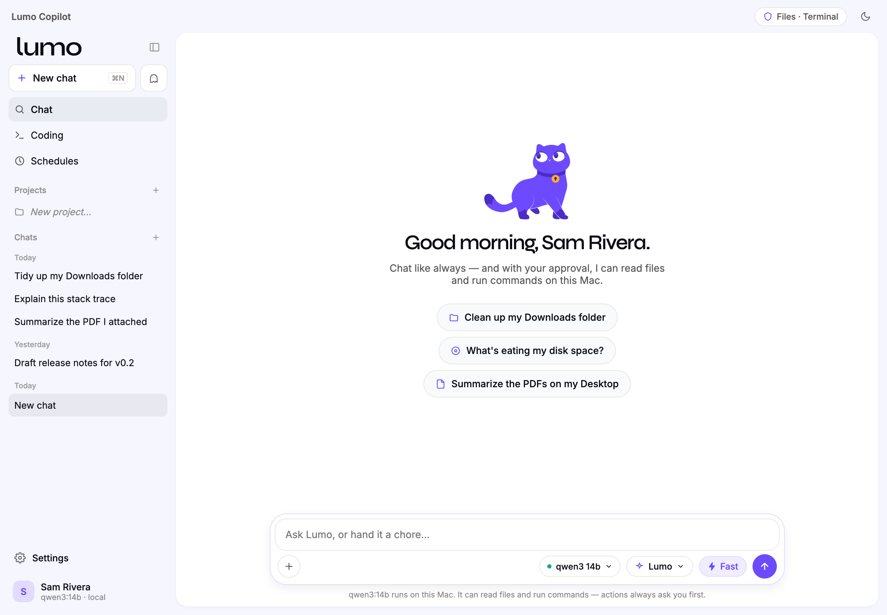
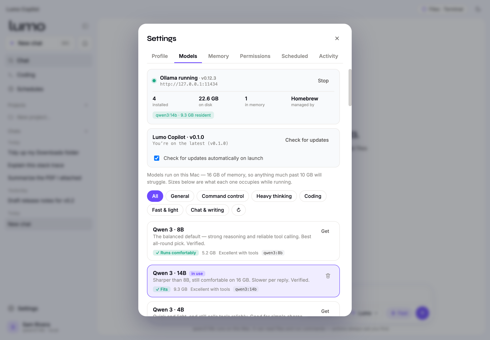
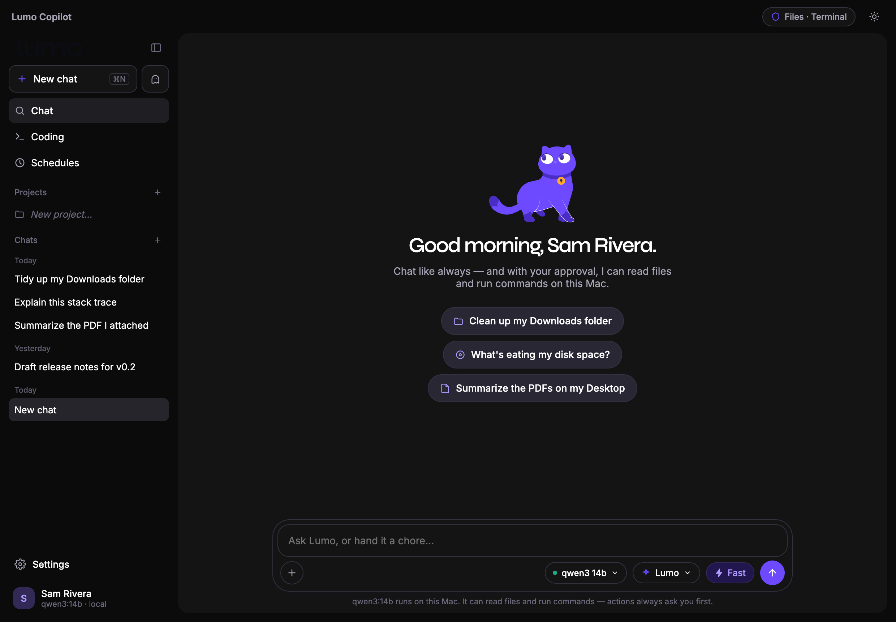

# Lumo Copilot

**A local-first AI copilot for your Mac. Your files, your model, your machine — nothing leaves your computer.**

  

Lumo Copilot runs an open language model *on your Mac* (via [Ollama](https://ollama.com)) and gives it careful, permissioned access to your files and terminal. It's a native desktop app: chat like you would with any assistant, attach a document for it to read, or hand it a real chore — *"what's eating my disk space?"* — and approve each action it wants to take. No account, no cloud, no telemetry.

This repository hosts the **public releases** — grab a `.dmg` from [Releases](https://github.com/dev-pruitt/lumo-copilot-releases/releases). The app is in active development.

## Why

Most AI assistants send your conversations — and increasingly your files — to someone else's servers. Lumo Copilot makes the opposite bet: the model runs locally, the backend is loopback-only, and the app has no sign-in and no analytics. The trade-off is that it's only as capable as the model your Mac can run — which, on Apple Silicon, is now genuinely useful.

## What it does

- **Private local chat** — talk to an open model (Qwen, Gemma, Llama, DeepSeek, and more) running entirely on your Mac.
- **Reads what you give it** — attach a file and it works from the text directly. No upload, no tool call — so even a small chat-only model can review a document.
- **Acts on your Mac, with your approval** — list files, read files, run shell commands, write and edit code. Every system-changing action shows you exactly what it will do and waits for your OK.
- **Knows what each model can actually do** — models are sorted into capability tiers (*chat* / *read* / *command control*), so a model is only offered the tools it can use reliably, and the UI never promises powers it doesn't have.
- **A real model picker** — 34 curated models across categories (General, Command control, Heavy thinking, Coding, Fast & light, Chat & writing), each labeled with how well it fits your Mac's memory.
- **A coding workspace** — file tree, editor, integrated terminal, git diff, and a live preview pane.
- **Projects, agents & schedules** — group conversations with shared context, define custom assistant personas, and set the Mac to run recurring chores.

  

## Privacy

- Runs entirely on your Mac. Your conversations and files never leave the machine.
- No account, no cloud sync, no analytics, no crash reporting.
- The local API is bound to `127.0.0.1` and origin-guarded, so other apps and web pages can't reach it.
- Every file write and shell command runs only after you approve it.

## Install

**Apple Silicon Macs only.** The build is currently **unsigned** (no paid Apple Developer certificate yet), so macOS Gatekeeper stops the first launch:

1. Download the latest `.dmg` from [Releases](https://github.com/dev-pruitt/lumo-copilot-releases/releases).
2. Open it and drag **Lumo Copilot** to Applications.
3. **Right-click the app → Open** — just the first time — to get past Gatekeeper.
4. On first run it offers to install [Ollama](https://ollama.com) and lets you pick a model.

The app checks here for newer releases and updates itself in a couple of clicks.

## Light & dark

Matched to your system theme.

  

## Status

Early alpha — built in the open, shared with friends for testing. Expect rough edges. An independent hobby project, not affiliated with any company.
